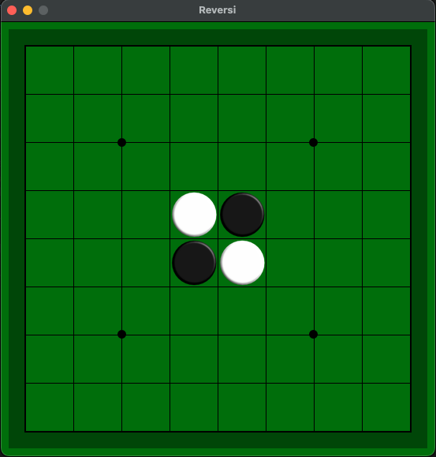
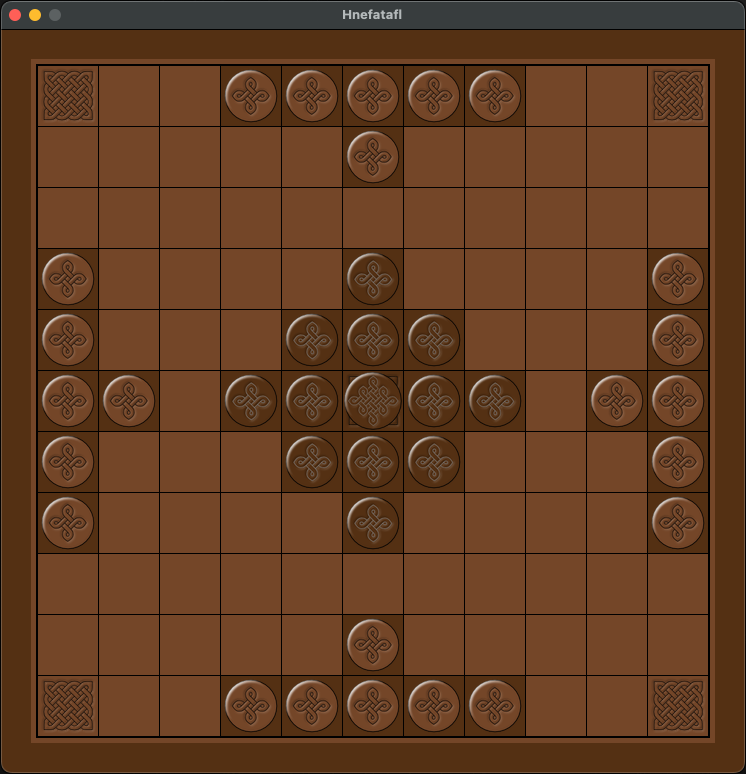
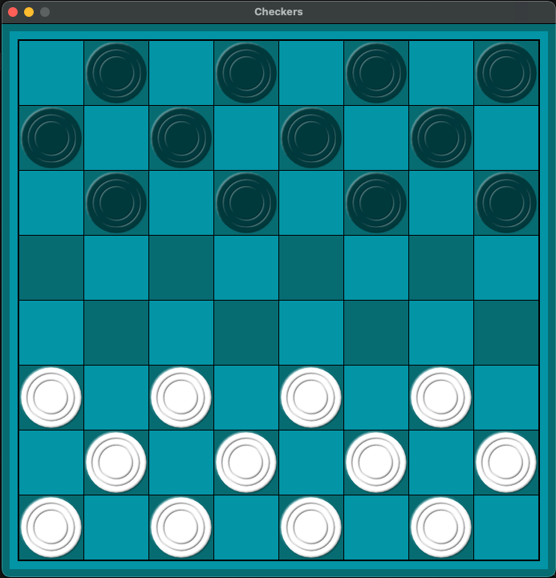
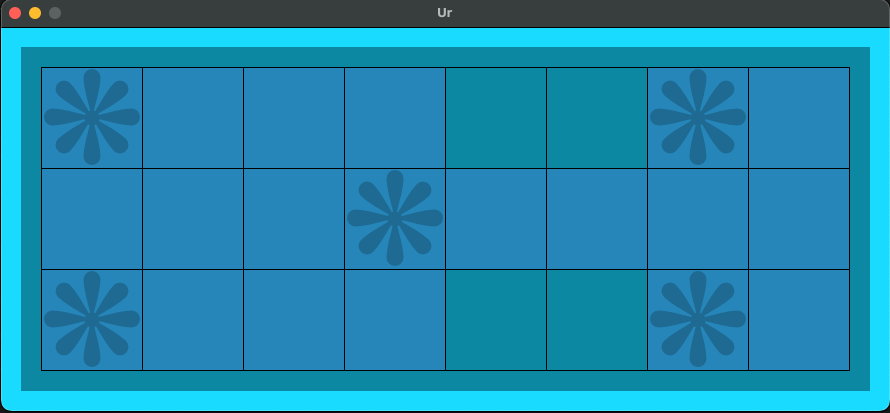

# pygame_board
# A tool that will generate a gameboard on a pygame surface by loading a definition from a toml file.

Install: 

`pip install git+ssh://git@github.com/Barrowcroft/pygame_board.git`

### Screenshots:

These gameboards were all generated from toml definition files.

Reversi

Hnefatafl

Checkers

The Royal Game of Ur

